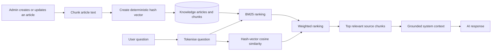

# DataMind AI

**DataMind AI** is a full-stack data-quality and impact-assessment application. It helps teams translate data-quality, governance, regulatory, and security issues into business context through grounded AI conversations, structured impact reports, and an admin-managed knowledge base.

The repository is shared as a portfolio project. It contains application source code, database schema and migrations, tests, and the retrieval implementation. No production credentials, customer data, deployment logs, or internal project metadata are included.

## What the application includes

| Area | Capability |
|---|---|
| AI consulting chat | Conversational guidance for data quality, governance, data security, and data-management questions. |
| Grounded retrieval | An admin-managed knowledge base that retrieves relevant source content before an AI response is generated. |
| Data-impact reports | A guided workflow that frames a data problem, financial impact, regulatory risk, recommendations, and ROI assumptions. |
| Knowledge-base administration | Article creation, activation, re-ingestion, and chunk management through the application’s admin experience. |
| User workspace | Authentication, saved conversations, report history, and conversation-tone preferences. |
| Delivery quality | TypeScript, database migrations, unit tests, linting, and production-build scripts. |

## Retrieval architecture

DataMind uses a deliberately transparent hybrid baseline rather than depending on an external embedding provider. Articles are split into overlapping chunks and indexed in the database. At query time, BM25 is the primary retrieval signal; a deterministic hash-vector cosine score acts as a secondary signal. The highest-ranked chunks are formatted with their sources and injected into the model context.



### Retrieval design choices

* **Chunking:** 120-word chunks with a 20-word overlap preserve context around natural document boundaries.
* **BM25:** Primary ranking works well for domain-specific vocabulary such as data-quality dimensions, governance frameworks, and regulatory terminology.
* **Secondary similarity:** A deterministic 128-dimensional hash vector adds a lightweight similarity signal without external embedding infrastructure.
* **Governance:** Only active articles are searchable. Re-ingestion removes old chunks before rebuilding them, preventing stale indexed content.
* **Source discipline:** Retrieved context carries article titles and source information so the assistant can ground its responses.

## Data-quality framework use

The seeded knowledge base includes a DAMA-DMBOK-oriented data-quality article covering completeness, consistency, accuracy, validity, uniqueness, timeliness, and integrity. These concepts guide how DataMind frames user problems and recommends controls. They are not presented as an automated compliance certification or live database-profiling engine.

## Technology stack

| Layer | Technology |
|---|---|
| Frontend | React, TypeScript, Vite, Tailwind CSS, shadcn/ui, Recharts, Mermaid |
| Backend | Node.js, Express, tRPC, TypeScript |
| Data | MySQL/TiDB-compatible database, Drizzle ORM and migrations |
| AI | Server-side LLM invocation with retrieval context injection |
| Testing | Vitest |
| Automation | GitHub Actions CI for type checking, linting, tests, and builds |

## Repository structure

```text
client/                  React user interface
  src/pages/             Chat, reports, dashboard, administration, and marketing views
  src/components/        Reusable UI and Mermaid diagram rendering
server/                  tRPC backend, AI prompts, RAG pipeline, data-access helpers
  rag.ts                 Chunking, BM25, hash vectors, cosine similarity, retrieval
  seed-knowledge.mjs     Curated knowledge-base seed content
drizzle/                 Database schema and SQL migrations
shared/                  Shared constants and types
```

## Local setup

### Prerequisites

* Node.js 22+
* pnpm 10+
* A MySQL/TiDB-compatible database
* Credentials for the LLM provider and, if enabled, OAuth providers

### Install and run

```bash
pnpm install
cp .env.example .env
# Fill in the values appropriate to your local environment.
pnpm db:push
pnpm dev
```

The development server uses the project’s server entry point. To run validation locally:

```bash
pnpm lint
pnpm check
pnpm test
pnpm build
```

## Environment variables

See [`.env.example`](.env.example). Never commit `.env` files, database URLs, OAuth secrets, LLM keys, or production values.

## Public-release notes

This source release intentionally excludes `node_modules`, build output, managed-platform runtime assets, local logs, environment files, Git history, private planning material, and managed-platform CI workflow files. Hosted platform credentials and services must be replaced with your own configuration to run a self-managed deployment.

## Portfolio contact

**Ayah Safin** — Senior Software & Data Engineer  
[LinkedIn](https://www.linkedin.com/in/safinayah/) · [GitHub](https://github.com/safinayah)
